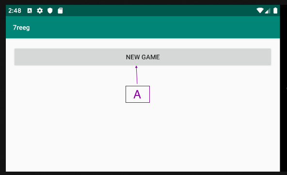
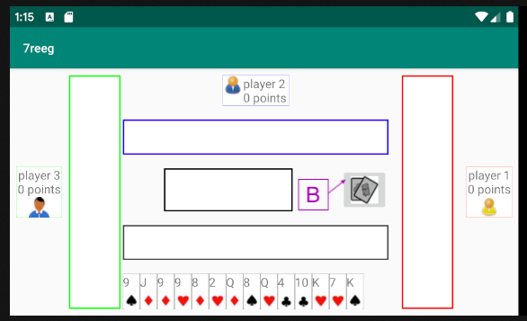
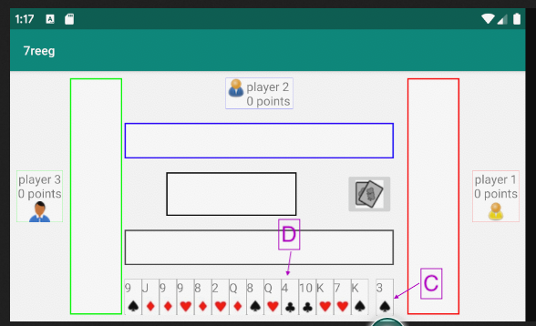
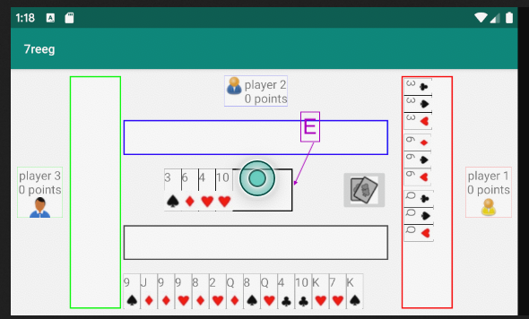
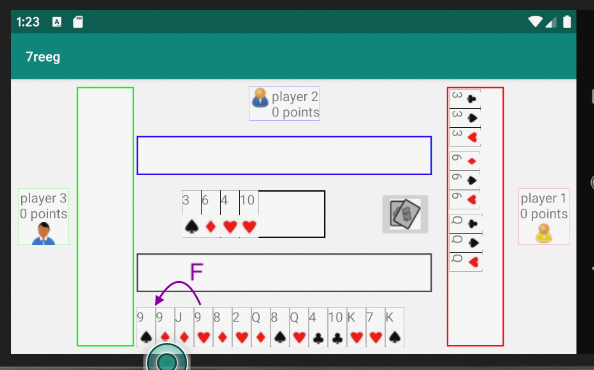
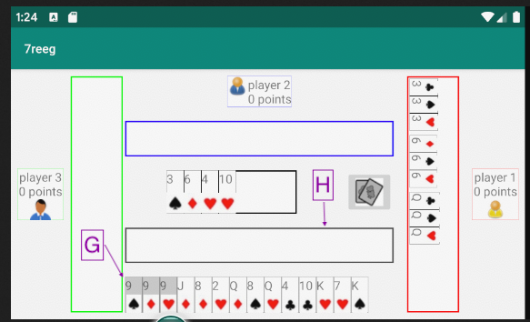
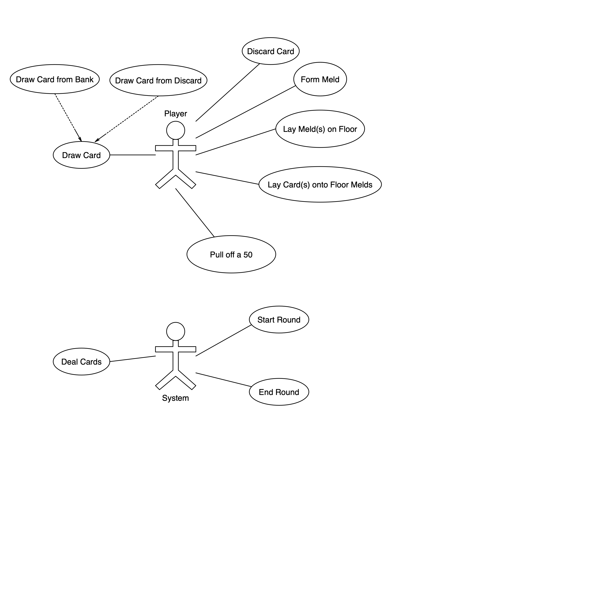

# 7reeg

<h2>Game description</h2>
<ol>

<li>14 is a variant of the Mexican cards game Conquian. </li>
<li>2 players can play with a single deck, up to 5 players can play with a double deck.</li>
<li>The game is played in rounds.</li>
<li>At each round, each player is dealt 14 cards and take turns to draw from bank and discard.</li>
<li>Each player tries to form melds: sets of 3 or 4 cards, or runs of 3 to 5 cards. </li>

<li>
When a player has formed melds whose totals honor 2 conditions, the player may lay melds on floor. At that point, the player’s status changes to ‘on floor’. The 2 conditions are:

  <ol>

  <li>
  Total number of cards melded should either be:
  <ol>
    <li>6, or</li>
    <li>6 if this is the first player to lay melds on floor. If not, the player should match number of cards melded by 1st player to lay melds on floor.</li>
  </ol>
  </li>

  <li>
  Total value of cards melded should either be:
  <ol>
    <li>51, or</li>
    <li>51 if this is the first player to lay melds on floor. If not, the player should match value of cards melded by 1st player to lay melds on floor.</li>
    <li>Each card is valued at its denomination if a number, or at 10 if a picture ( jack, queen, king & ace). An ace is valued at 1 in runs of more than 3 cards.</li>
  </ol>
  </li>

  </ol>

</li>

<li>A player may, instead of drawing from bank, draw from discard (of previous turn player) ONLY to lay melds on floor.</li>
<li>A player who is on floor may lay cards over any floor meld at his or her turn.</li>
<li>The player who wins the round is the one who gets rid of all 14 cards by melding and laying cards over melds.</li>
<li>The player can pull off a ‘50’ by winning using a card drawn from discard if he or she is able to shout ‘50’ within a few seconds (approximately 4) of the card being discarded by previous turn player.</li>
<li>Each player’s score is the number of cards they remain with at the end of the round. The winner is deducted a point, or 3 points if having pulled off a 50. The player on who a 50 was pulled off is added 3 points.</li>
<li>When a player’s score exceeds 30 points, he or she is eliminated.</li>

</ol>

<h2>How to play a round</h2>
<ol>

  <li>
  Start game (A). This will also start first round. 
  
  </li>

  <li>
  Draw from bank by (B) clicking bank button and dragging card displayed to bottom right of hand (C) to appropriate position within hand (D).  
  
  
  </li>

  <li>
  Discard a card by dragging it onto discard box (E). CPU players will follow to draw and discard. 
  
  </li>

  <li>
  Form melds by dragging cards within hand (F). Once a meld is complete it will be highlighted (G) and can be dragged to floor melds box (H). 
  
  
  </li>

</ol>

<h2>Use Cases</h2>

A Game is made up of several Rounds.

<h3>Game Use Cases</h3>

TBD

<h3>Round Use Cases</h3>

 

<h2>Use Case Realizations</h2>

<h3>Game Use Case Realizations</h3>

TBD

<h3>Round Use Case Realizations</h3>

 
<a href="apidoc/index.html">API documentation</a> 

